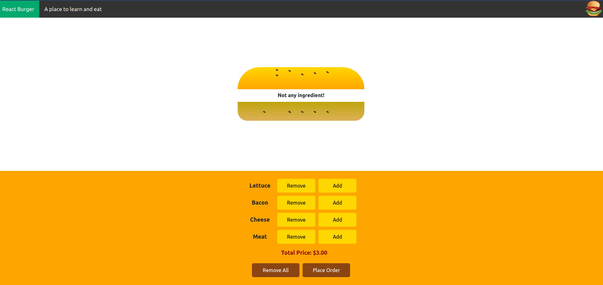

# React Burger App

Welcome to the React Burger App! This delightful application allows you to create and customize your own virtual burger by adding layers of delicious ingredients. No login or signup required—just enjoy the burger-building experience!



## Features

- 🍔 Build your own burger by adding layers of ingredients.
- 🚀 Fast and smooth interaction with a responsive user interface.

## Getting Started

Follow these simple steps to get the app up and running on your local machine.

### Installation

```bash
npm install
```

### Run locally

```bash
npm start
```

Open the local address printed by the development server. Add up to ten ingredients,
remove individual ingredients, or use **Remove All** to reset the burger. The base
price is $3.00; each selected ingredient adds its displayed total to the price.
**Place Order** displays a demo confirmation and resets the burger; it does not
submit an order to a restaurant or collect payment.

### Tests and production build

```bash
CI=true npm test -- --watchAll=false --runInBand
npm run build
```

This project uses an older Create React App/Webpack toolchain. If a modern Node.js
version reports `ERR_OSSL_EVP_UNSUPPORTED`, use the following command-scoped
compatibility option for the build (or replace `build` with `start` for development):

```bash
NODE_OPTIONS=--openssl-legacy-provider npm run build
```

The production files are written to `build/`. Interaction tests cover ingredient
prices, batched additions, the ingredient limit, clearing, and order confirmation.
